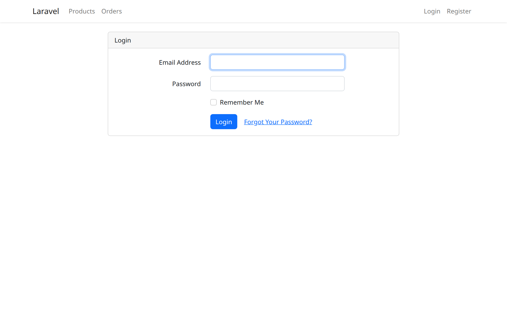

# 🛍️ Laravel E-Commerce

Platform e-commerce berbasis **Laravel 12** — katalog produk, keranjang belanja, pesanan, dan transaksi dengan autentikasi pengguna.

## Tampilan



## Fitur

- **Autentikasi** — registrasi & login (Laravel UI + Bootstrap)
- **Katalog Produk** — jelajah dan kelola produk
- **Keranjang Belanja** — tambah/hapus item sebelum checkout
- **Pesanan & Transaksi** — pembuatan pesanan dan pencatatan transaksi
- **Profil Pengguna** — kelola data akun

## Tech Stack

- Laravel 12 (PHP ≥ 8.2)
- MySQL
- Bootstrap (Laravel UI) + Vite

## Instalasi

```bash
git clone https://github.com/iostream-code/laravel-ecommerce.git
cd laravel-ecommerce
composer install
npm install && npm run build

cp .env.example .env
php artisan key:generate
# sesuaikan koneksi database (DB_DATABASE, DB_USERNAME, DB_PASSWORD) di .env

php artisan migrate
php artisan serve
```

Buka http://localhost:8000

## Riwayat

Dibangun tahun 2023 dengan Laravel 9 (nama repo semula: laravel-9-ecommerce); dipugar ke **Laravel 12** (Oktober 2026) — `fruitcake/laravel-cors` digantikan middleware CORS bawaan framework, sisa Laravel Mix dibersihkan (full Vite), kompatibel PHP 8.2–8.5, migrasi & test terverifikasi.
