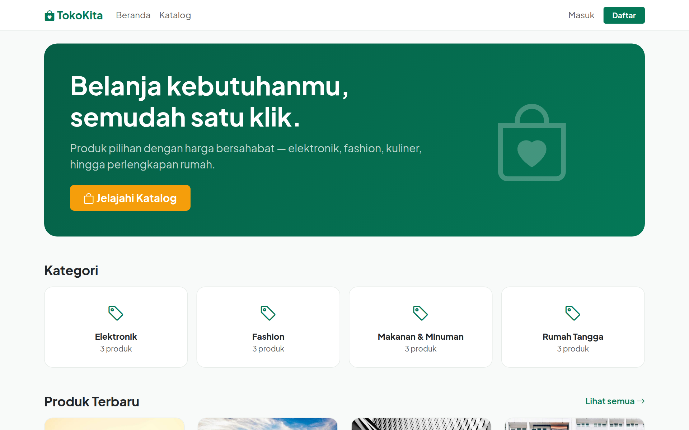
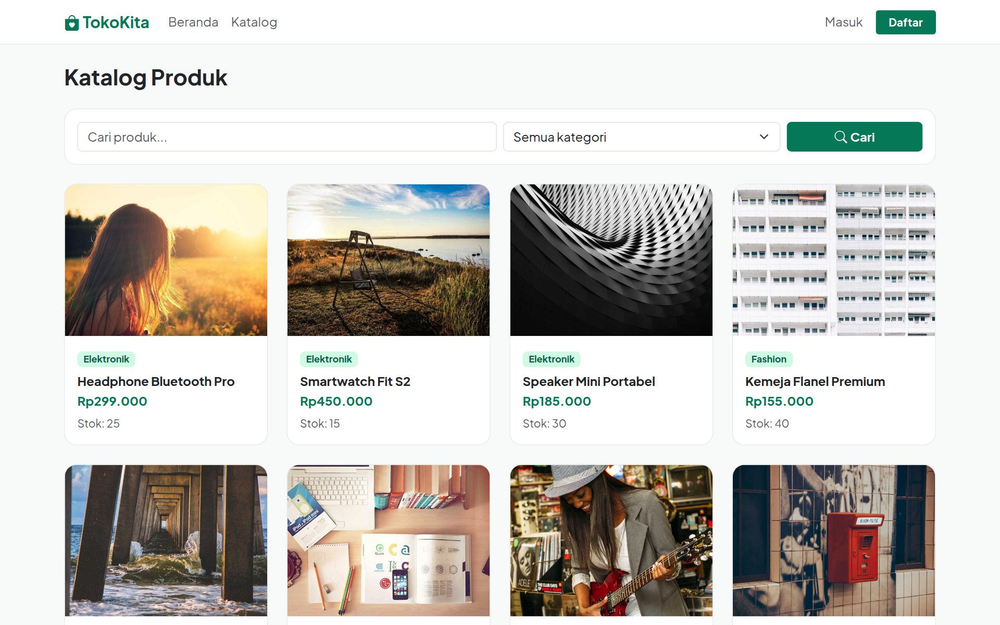
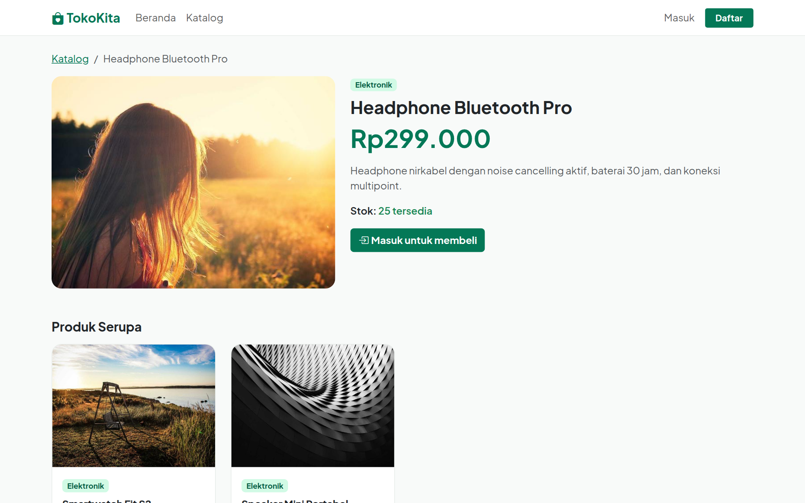
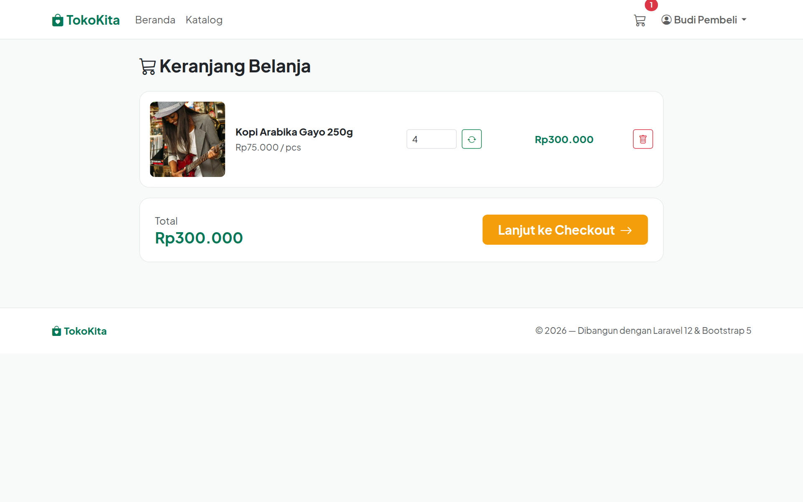
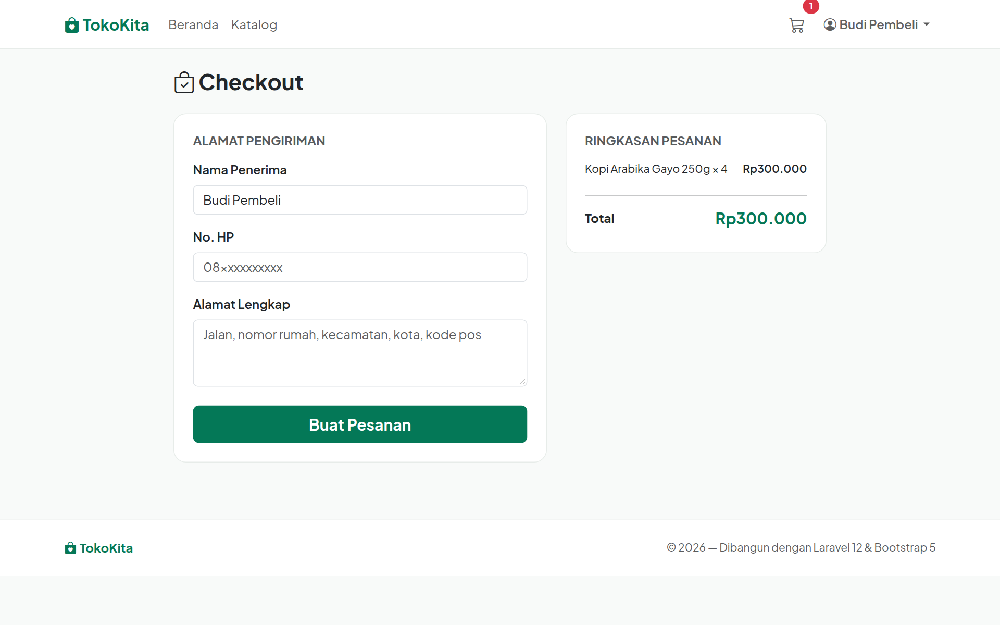
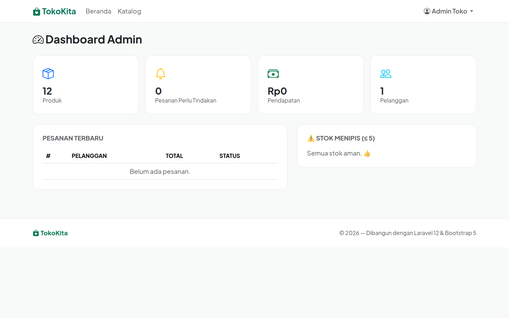

# 🛍️ TokoKita — Laravel E-Commerce

Platform e-commerce lengkap berbasis **Laravel 12**: storefront publik, keranjang & checkout dengan stok atomik, pembayaran **Midtrans Snap** (fallback transfer manual), dan dashboard admin.

## Tampilan

| Landing | Katalog |
|:---:|:---:|
|  |  |

| Detail Produk | Keranjang |
|:---:|:---:|
|  |  |

| Checkout | Dashboard Admin |
|:---:|:---:|
|  |  |

## Fitur

**Storefront (publik, tanpa login)**
- Landing page dengan kategori & produk terbaru
- Katalog dengan pencarian, filter kategori, dan pagination
- Halaman detail produk + produk serupa (URL ber-slug)

**Pembeli**
- Keranjang: tambah/ubah jumlah/hapus, validasi stok
- Semua gambar upload (produk & bukti bayar) otomatis dikonversi ke **WebP** dan diperkecil
- Checkout dengan alamat pengiriman; **stok dikurangi secara atomik** (DB transaction + row lock) dan harga dikunci saat pembelian
- Pembayaran: **Midtrans Snap** (kartu, VA, e-wallet — sandbox) bila dikonfigurasi, otomatis fallback ke **transfer manual + upload bukti** bila tidak
- Riwayat pesanan dengan status berjenjang: menunggu pembayaran → verifikasi → dibayar → dikirim → selesai

**Admin** (`is_admin`, dilindungi middleware)
- Dashboard: statistik produk/pesanan/pendapatan/pelanggan + peringatan stok menipis
- CRUD produk (upload gambar, kategori, slug otomatis)
- Kelola pesanan: filter status, verifikasi bukti transfer, ubah status

**Keamanan** (diuji otomatis — 7 test)
- Route admin tertutup untuk pembeli; pesanan hanya terlihat pemiliknya
- Webhook Midtrans terverifikasi tanda tangan via SDK resmi

## Tech Stack

Laravel 12 (PHP ≥ 8.2) · MySQL · Bootstrap 5 · Midtrans Snap · Vite

## Instalasi

```bash
git clone https://github.com/iostream-code/laravel-ecommerce.git
cd laravel-ecommerce
composer install
npm install && npm run build

cp .env.example .env
php artisan key:generate
php artisan storage:link
# sesuaikan koneksi database di .env

php artisan migrate --seed
php artisan serve
```

**Akun demo** (password `password123`): `admin@demo.test` (admin) · `budi@demo.test` (pembeli)

### Mengaktifkan Midtrans (opsional)

1. Daftar akun sandbox di https://dashboard.sandbox.midtrans.com
2. Isi di `.env`:
   ```
   MIDTRANS_SERVER_KEY=SB-Mid-server-xxxx
   MIDTRANS_CLIENT_KEY=SB-Mid-client-xxxx
   ```
3. Atur Payment Notification URL ke `https://domain-anda/midtrans/callback`

Tanpa key, aplikasi otomatis memakai alur transfer manual — tetap berfungsi penuh.

## Riwayat

- 2023 — dibangun dengan Laravel 9 (nama repo semula: laravel-9-ecommerce)
- Okt 2026 — dipugar ke Laravel 12
- Okt 2026 — **dirombak total**: storefront publik, role admin + middleware (sebelumnya semua user bisa mengelola produk), kategori & slug, status pesanan berjenjang, checkout atomik, Midtrans Snap, dashboard admin, redesign UI, 7 test keamanan
